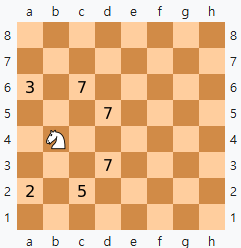

# 2025. 나이트투어

2025년을 기념할 겸, 1111번 문제로 2025번 문제를 풀었다. 스코어는 250/256이다.

당연히 내 머리로 생각해서 푼 건 아니고, 구글신의 도움을 받았다. 내가 이걸 혼자 풀었으면 여기 이런걸 쓰고 있는 대신 코포같은데서 문제 출제하고 있었겠지...

접근 방법은 간단하다. 구글을 켠 뒤, knight tour를 검색하면 [위키피디아](https://en.wikipedia.org/wiki/Knight%27s_tour) 페이지가 나온다.

필요한 내용을 요약해서 아래 정리한다.

## 해의 존재성

Schwenk이 임의의 $m \leq n$를 만족하는 $(m, n)$ 쌍에 대해 다음 조건을 ***전부 만족하지 않으면*** closed tour, 즉 해밀턴 순환이 존재한다고 증명했다.

1. $m$과 $n$이 모두 홀수
2. $m \in \{1, 2, 4\}$
3. $m = 3$이고 $n \in \{4, 6, 8\}$

그리고 Cull과 Conrad가 다음 조건을 ***전부 만족하지 않으면*** open tour, 해밀턴 경로가 존재한다고 증명했다.

1. $m \in \{1, 2\}$
2. $m = 3$이고 $n \in \{3, 5, 6\}$
3. $m = 4$이고 $n = 4$

## 과연 전부 다 존재할까?

이 문제에서는 $6 \leq N \leq 666$인 정사각형 보드만 주어지므로 모든 경우에 대해 답이 존재할 것 같지만, 시작점도 임의로 주어지기 때문에 아니다.

체스판의 좌하단을 $(1, 1)$로 보고 $(X + Y)\%2$이 0이면 검은색, 1이면 흰색으로 칠한다고 생각해보자.

그러면 $N$이 홀수일때 검은 칸은 $(N^2 >> 1) + 1$개, 흰 칸은 $(N^2 >> 1)$개 존재한다.

이 때 시작점이 흰 칸으로 주어지면, 즉 좌표의 합이 홀수인 칸이 시작점으로 주어지는 경우를 생각해보자.

나이트는 흰 칸에서 검은 칸으로, 검은 칸에서 흰 칸으로 이동할 수 있다. 따라서 나이트 투어의 경로는 반드시 두 색이 번갈아가며 등장해야 하는데, 시작점을 흰 칸으로 한다면 $(N^2 - 1)$칸 이동했을 때 나이트는 검은 칸에 있지만 남은 한 칸도 검은 칸이다.

나이트는 검은 칸에서 검은 칸으로 이동할 수 없으므로 흰 칸에서 시작하는 나이트 투어는 존재하지 않는다.

즉 $N$이 홀수이고 시작 좌표의 합이 홀수일 때 $-1\,-1$을 출력하여 테스트 케이스 몇 개를 긁을 수 있다!

참고로 -1 -1을 출력하는 입력은 총 28개가 존재한다.

## 존재하는 해를 어떻게 구할 수 있을까?

나이트 투어를 해결하는 대표적인 방법은 백트래킹이다. 하지만 443556 칸을 전부 다 백트래킹으로 탐색하기에는 시간이 너무 오래 걸린다. 따라서 휴리스틱한 방법으로 접근해야 한다.

여기서 등장하는 것이 [Warnsdorf's rule](https://en.wikipedia.org/wiki/Knight%27s_tour#Warnsdorf's_rule)이라는 것이다.

나이트가 움직일 때, 이동할 수 있는 칸들 중에서 다음으로 이동할 수 있는 칸이 제일 적은 칸으로 움직인다.

위 그림에서 나이트는 6개의 칸으로 움직일 수 있다. 6개의 칸 중 다음으로 움직일 수 있는 경로가 제일 적은 칸은 2가 적힌 A2셀이니 A2로 움직인다.

휴리스틱보단 그리디에 가까워보이지만, 휴리스틱은 엄밀한 수학적 증명 없이 적당히 좋은 결과를 내는 알고리즘이니까 Warnsdorf의 규칙은 휴리스틱이라고 할 수 있다.

## 효율 개선하기

Warnsdorf's rule을 개선하기 위한 [두 가지 방법](https://stackoverflow.com/questions/8402648/how-to-improve-knights-tour-with-warnsdorffs-rule)이 있다.

### Arnd Roth's proposition

각 칸에서 움직일 수 있는 다음 칸의 개수를 degree라고 하자. 그러면 degree가 같은 칸들에 대해, 체스판 정중앙으로부터의 직선 거리가 가장 먼 것을 우선하겠다는 뜻이다.

### Ira Pohl's proposition

움직일 수 있는 칸들 중 degree가 같은 칸들에 대해, 해당 칸들에서 옮겨갈 수 있는 칸들의 degree를 합쳐서 작은 쪽에 우선순위를 부여한다.

위 두 가지 개선안중 첫 번째 개선안만 적용하여 250개를 맞출 수 있었다.

두 번째 개선안에 백트래킹을 조금 더하면 256개를 다 맞출 수 있을거 같은데... 잘 모르겠다. 아직 두 번째까지 더해서 224개를 넘기지 못했다. 휴리스틱이라 그런가 역시 어설프게 적용하면 더 안 좋아지는 것 같다.

#### 여담

첫 방에 250개 맞춘게 기적이네. 계속 코드 바꿔가면서 긁는데 200개 넘기기도 힘들다.
