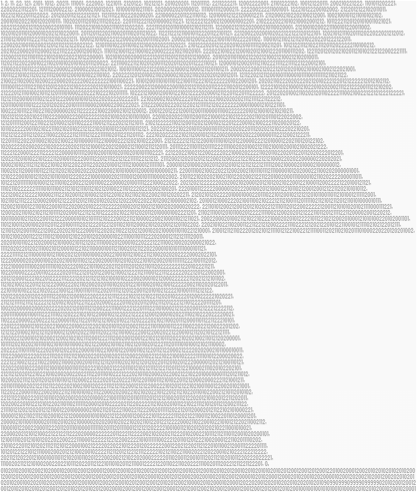

# 08481. [Generator](./08481.cpp)

어유 끔찍해라

## 00

단순 출력이다.

## 01

Run Length Encoding 기법을 활용한다. 각 문자마다 반복되는 횟수를 찾아내면 문장 하나와 수열로 압축할 수 있다.

가끔 가다가 한두문자는 5000대에서 노는 것을 볼 수 있는데, 이는 원본 문장에서 원래는 문자가 두 번 나오는거다. 예를 들어 terrorizes 에서 rr 이라던가.

## 02

피보나치 수인데, $mod \space 9099099909999$ 이다. 모듈러가 커서 64비트 정수를 써야한다.

이 숫자는 자주 나오니 전역 상수로 정의해놓자.

## 03

시에르핀스키 삼각형이다. $i\space \oplus \space j$ 로 표현 가능한데, 506~510줄 끄트머리에 장난이 숨어있다. 그냥 문자열 덮어쓰기하면 쉬운데 왜 굳이 인덱스를 다 찾았을까...?


## 04

합성수를 1로, 소수를 0으로 표시한 수열이다. 3333줄에 장난을 쳐놓았다.

## 05

폴란드어 달력이다. 상당히 뭣같은게, 나는 본투비 김치맨이라서 폴란드어따위는 모른다.

그래도 기수랑 월, 일, 연도를 대충 저장해놓고 달력에 맞게 출력을 하면 되긴 된다.

4월 1일이랑 6월 1일 하나씩 장난질이 있다. 마무리에도 끝. 이라는게 있다.

## 06

사전순 순열 구하기이다. 인덱스는 4제곱인것을 금방 알아챌 수 있는데, 왼쪽 문자열은 도저히 모르겠어서 구글링을 했었다. 알고 나니 좀 허무했다...

## 07

"0", "1", "2", "9", ",", "." 를 전광판마냥 출력하는 문제다.

일단 파싱을 해서 숫자를 확인을 해보니, 맨 마지막의 9099099909999를 제외하고 0, 1, 2만 나와서 삼진법까지 눈치를 챘다. 그 다음부터가 문제였는데, 10진법 변환을 걸면 분명 2의 지수 형태가 나오다가 갑자기 어그러진다.

그래서 2의 지수승을 3진법으로 출력해서 비교를 해보니, 뒤집은 형태인걸 알 수 있었다.

차라리 뒤집은 형태인게 더 좋은게, 빅인트 구현을 하면 보통 little endian 형태라서 뒤집지 않고 바로 출력해버리면 똑같아지기 때문이다.

아무튼 그렇게 $2^{170}$까지 처리를 해주고, 맨 마지막 0.01020 어쩌고는 도저히 모르겠어서 하드코딩해버렸다. 궁금해서 좀 찾아봤지만 정보가 없다. 대체 무슨 수일까?



## 08

그림 그리기 1번. 나선을 그리면 된다. 대략 3만개정도의 #이 있는데, 시작점을 눈대중으로 찾아놓는다. 그런 다음, #이 한 방향으로만 퍼져나가는 것을 보고 시작 좌표 + dx, dy로 표현해줬다.

이러면 0~7 까지의 숫자 중 하나를 3만번가량 쓴게 나오니까, 이걸 base 64로 압축해버리면 대략 15000B 정도로 밀어버릴 수 있다.


## 09

그림 그리기 2번. 현대 미술인가?

이번엔 선분들이 여러개 있다. 우선 선분의 방향을 4 방향으로 제한하고, 중복 상관없이 모든 세그먼트를 구해준다. 다음, 제일 긴 것부터 그리드에 덮어씌우면서 기존에 다 칠해진 선분이 있다면 그 선분은 제거한다.

이러면 총 277개의 선분이 나오고, 시작 지점의 X(3), Y(4) 좌표와 방향(1), 길이(3)까지 해서 총 11자리의 정수로 선분을 표현할 수 있다. Y 좌표가 4자리인게 있어서 조금 슬펐지만, 어쩌겠는가.


## 10

대망의 마지막 문제. 참고로 이 문제에서 영감을 받아 만들어진 문제가 [18163번, Binary Matrix](https://www.acmicpc.net/problem/18163) 라고 한다. 이 문제는 루비 2이다.

아무튼, 파일을 열어보면 맨 첫 줄이 이렇다.

```text
a_i = a_{i-1} . a_{i-2}
```

그렇다. 피보나치이다. 아래의 0과 1로 이루어진 수열들을 잘 살펴보면, 길이가 피보나치 수임을 알 수 있다. 정확하게는 이 수열은 "0" 과 "1 0" 두 개의 수열을 초기항으로 하고, 수열을 이어붙여서 만든 변종 피보나치 수열이다.

단지 좀 귀찮았던 것은 a_9와 a_10의 공백 숫자가 달라야 한다는 점?

이게 다 끝나면, 이제 진짜가 나온다.

```text
(A_i)^n = B_i (mod 2)
```

그리고 아래에는 이진 행렬이 잔뜩 써 있다. 여기서 골머리를 좀 앓았는데, 일단 좌변의 행렬을 $N$번 거듭제곱한게 우변이라는 것 같다. 참고로 이 $N$ 를 구하는게 18163번 문제다. ㅋㅋ

이 문제를 풀려고 18163을 푸는건 말이 안 되고, 그냥 위에서 정의한 상수 9099099909999를 지수로 넣으니 잘 맞아떨어졌다. 이게 매직 넘버지.

지수가 꽤 크다보니 무조건 고속 거듭제곱을 써야하고, 추가적으로 행렬 최대 크기가 70임에 착안해서 bitset<70> 으로 밀어버렸다. 이게 더 빠른진 몰?루

마지막으로 $A_i$의 각 성분이 어떻게 만들어졌는지 봐야하는데, 이건 생각보다 쉬웠다. 위에서 만든 수열을 그대로 정사각행렬에 쑤셔넣은 것이다. 위에서 한 그대로 길이가 4900이 넘을때까지 수열을 만들고, 이걸 정사각행렬에 넣어서, 거듭제곱을 한 다음 출력하면 된다.

여담으로 diff 명령어로 답과 출력을 비교했는데, 이 문제에서 공백때문에 diff 결과가 엉망이 되어서 고생을 좀 했다. 결과적으로는 전부 다 잡아내서 diff 명령어를 실행해도 아무것도 안 나오도록 맞춰주긴 했다.
