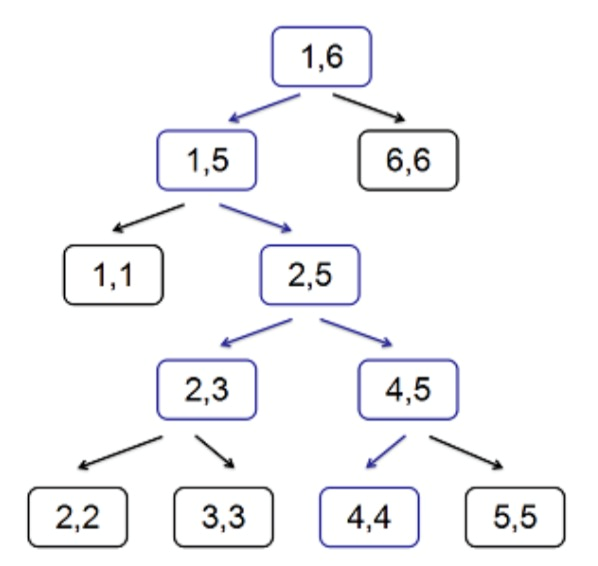

# 13067. [Interval Tree](./13067.cpp)

대충 세그먼트 트리의 확장쯤 되는 트리에서 특정 정점 방문수를 가지는 구간의 개수를 출력하는 문제다.

일단 나는 센트로이드 분할 + HLD + FFT로 풀었다. 조합부터 예사롭지가 않고, 이 개고생을 하고도 TLE가 날까봐 조마조마했다. 5초짜리 문제에서.

일단 정점 방문수에 대한 엄밀한 정의가 필요하다.

문제에 써 있지만, 이 정의를 계속 곱씹어야 하니까 여기서도 간략하게 기술한다.

구간 $[l, r]$에 대해, $S[l, r]$은 다음 두 조건 중 하나를 만족하는 정점들의 집합이다.

1. 정점 $v$가 담당하는 구간이 $[l, r]$에 포함되지만, 그 부모 정점은 그렇지 않다.
2. 적어도 하나의 자손 정점은 1번 조건을 만족한다.

그리고 $[l, r]$의 복잡도는 $S[l, r]$의 크기이다.

예제를 보자.

파란색으로 마킹된 정점이 $S[2, 4]$에 포함된다.

쉽게 표현하자면, 특정 구간을 탐색할 때 방문하는 정점 수가 몇 개? 가 복잡도이고, 방문하는 정점 수가 이만큼인 구간이 몇 개? 가 문제다. 이하에서 탐색 비용은 방문한 정점의 수를 뜻한다.

트리가 표현하는 범위의 크기를 $N$이라 하면 구간의 개수는 $O(N^2)$개 존재한다. 균형잡힌 트리라고 해도 구간당 $log(N)$ 쿼리가 필요하고, 높이가 $O(N)$이면 세제곱이 될테니 단순 구현은 바로 TLE빔이다.

따라서 구간을 하나씩 볼 것이 아니고, 구간을 어떠한 조건에 맞춰 뭉쳐야한다. 각 구간은 두 끝점으로 표현되고, 이 끝점들은 트리상에서 하나의 leaf 정점에 해당한다. 그리고 두 leaf 정점을 표현할 수 있는 방법 중 하나가 LCA이다.

정점 $v$를 LCA로 갖는 모든 구간 $[l, r]$에 대해, 적당한 시간 복잡도로 탐색 비용을 구할 수 있다면 괜찮은 시간 복잡도로 문제를 해결할 수 있을 것 같다.

여기서 더 나아가서, $v$에서 왼쪽 leaf 로 향하는 경로와 오른쪽 leaf로 향하는 경로는 서로 영향을 끼치지 않는다. 세그먼트 트리에서 왼쪽 자식과 오른쪽 자식의 결과를 재귀적으로 더해서 올라가는 것처럼, 여기서도 양쪽 자식 정점의 정보를 합쳐서 정점 $v$에서의 결과를 얻을 수 있을 것이다.

다만 이번에는 단순 합이 아닌게 중요하다. 정점 $v$를 LCA로 갖는 $(l, r)$ 쌍은 여러 개 있을 것이며, 각 쌍마다 탐색 비용, 즉 $|S[l, r]|$ 값이 전부 다르다. 그래서 결국 질문을 이렇게 바꿔서 볼 수 있다.

정점 $v$를 LCA로 갖는 모든 구간 $[l, r]$에 대해, $|S[l, r]| = k$ 인 $[l, r]$의 개수가 몇 개인가?

자, 여기서 잘 생각해야 한다. LCA $= v$일 때 $|S[l, r]|$은 다음과 같이 분해된다.

- $v$의 조상과 $v$ 자신: $v.\text{depth} + 1$개
- 좌측 탐색 비용: $l$을 방문하기까지 좌측 서브트리 안에서 $l$을 포함하여 방문한 정점의 수
- 우측 탐색 비용: $r$을 방문하기까지 우측 서브트리 안에서 $r$을 포함하여 방문한 정점의 수

$v$의 조상 및 $v$ 자신은 항상 고정이니까 상수로 빠지고, 결국 합이 특정 값인 쌍의 개수를 세는 문제가 된다. 당연하게도 각 서브트리는 독립적이므로, 컨볼루션이다.

아 이거 언제 또 다항식 변환 설명하지 진짜 아득하네
