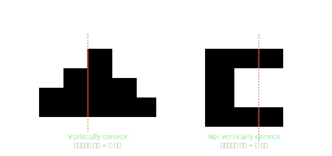
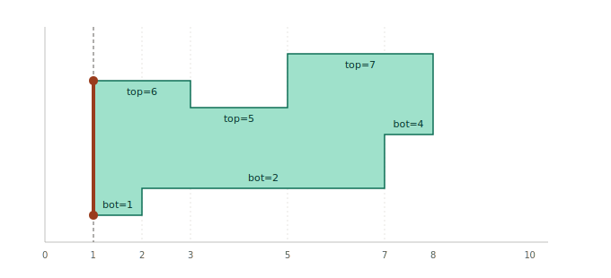
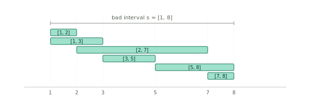
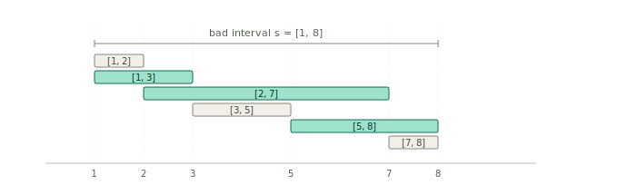
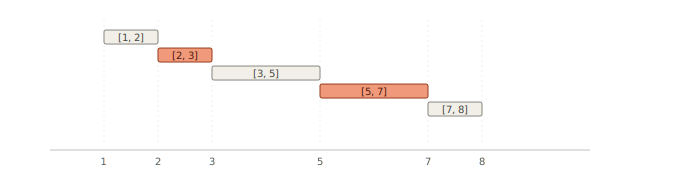

# 13068. [Interval](./13068.cpp)

겉보기에 그리디같지만, 까보면 뭔 1980년대, 1990년대 논문이 튀어나온다.

2차원 직교 정수 좌표계를 생각하자[^integer]. 이 위에 X축과 Y축에 평행한 선분으로만 이루어진 다각형이 있다. 내부에 구멍이 있을 수 있다.

이 때, 해당 다각형 내에 포함되는 직사각형들을 사용하여 다각형을 덮을 때(단, 직사각형끼리 겹칠 수 있다), 직사각형의 최소 개수를 구해보자.

이 문제 자체는 NP-Hard이지만 제한이 붙으면 다항 시간 안에 풀 수 있다.

임의의 수직선에 대해 도형과의 교집합이 하나의 연속된 선분일 때 해당 도형은 vertically convex 하다고 한다. 수평선에 대해서도 같은 방식으로 horizontally convex 가 정의된다.

*vertically convex 예시*

원래 문제에서는 hole이 존재할 수 있지만, vertically (또는 horizontally) convex인 다각형은 hole을 가질 수 없다.

수직과 수평 모두에 대해 convex한 경우에 대한 다항 시간 해결법이 1981년에 제시되었다[^1].

이어서 1984년, 한 방향에 대해서 convex 한 경우에 대한 다항 시간 해결법이 제시되었다[^2].

1996년, Knuth가 [^2] 논문의 상세 구현법을 제시했다[^3].

그래서 구간을 덮는 문제에서 갑자기 다각형 이야기가 왜 나오느냐 하면, vertically (또는 horizontally) convex인 다각형을 직사각형으로 덮는 문제는 1차원 구간을 구간으로 덮는 문제로 환원할 수 있다. 그러니까 이 문제는 사실 다각형의 덮개를 찾는 문제인 것이다.

다시 말하지만 지금까지 모든 다각형은 전부 변이 X축이나 Y축에 평행하고, convex의 정의도 살짝 다르다. 일반적인 convex 다각형이 아님에 주의하자.

일반성을 잃지 않고 주어진 다각형이 vertically convex라고 하자.

vertically convex 조건에 의해 각 $x$ 좌표를 지나는 수직선과 다각형의 교집합은 하나의 수직 선분이다. 이 선분의 위/아래 끝점을 각각 $\text{top}(x)$, $\text{bot}(x)$ 로 두면, 다각형은 다음과 같이 기술된다.

$$P = \{(x, y) : \text{bot}(x) \le y \le \text{top}(x)\}$$

도형의 변이 모두 축에 평행하므로 $\text{top}$, $\text{bot}$ 은 $x$ 에 대한 조각 상수 함수이고, 값이 점프하는 지점이 정확히 다각형의 수직 변 위치다. 따라서 $\text{top}$ (또는 $\text{bot}$) 함수의 상수 구간 하나는 다각형의 수평 변 하나와 1:1 대응한다.

*수직선이 좌에서 우로 이동할 때, top(x) 와 bot(x) 값이 수직 변에서 점프한다.*

위 예시 도형의 수평 변들을 정리하면:

- 윗변 (top edges): $\text{top}=6$ on $[1,3]$, $\text{top}=5$ on $[3,5]$, $\text{top}=7$ on $[5,8]$
- 아랫변 (bot edges): $\text{bot}=1$ on $[1,4]$, $\text{bot}=2$ on $[4,6]$, $\text{bot}=4$ on $[6,8]$

총 6개의 수평 변이 있고, 각 변이 구간으로 환원된다. 이렇게 추출한 구간들을 모은 집합

$$F = \{[1,3],\ [3,5],\ [5,8],\ [1,2],\ [2,7],\ [7,8]\}$$

이 우리가 풀고자 하는 문제, 1차원 구간 집합을 생성할 수 있는 최소 집합을 찾는 문제의 입력이 된다.

원래는 다음으로 직사각형 집합의 최소 크기와 1차원 구간 집합을 생성하는 최소 집합의 크기가 일치함을 보여야 하는데, 이거까지 할라니까 글이 너무 길어진다. 일단 어쨌거나 주 관심사는 1차원 구간 집합을 생성하는 최소 집합이니까, 환원 과정에 대해 관심있는 사람은 [^2]논문을 읽어보자.

이제 알고리즘 내용으로 들어가보자. 논문 내용을 구현해야 하는만큼, [^3] 논문의 진행을 그대로 따라가겠다. 전문적인 논문 분석글은 아니니까, 아주 상세하게 쓰지는 않을 것이다.

이하부터 구간의 정렬은 사전순으로, 정렬 순서는 오름차순으로 가정한다. 또한 구간들의 합은 구간들의 합집합으로 정의한다.

구간 집합 $F$ 에 대해, 다음 개념들을 정의하자.

1. $F$ 의 원소들을 어떠한 순서로 나열할 때, 모든 원소가 직전까지 나열된 원소들에 포함되지 않은 새 점을 적어도 하나 포함하면 **$F$ 를 $irredundant$ 하다** 고 한다.
2. 두 구간 집합 $F$ 와 $G$ 에 대해, $F$ 의 모든 원소가 $G$ 의 원소들의 합으로 표현될 수 있다면 **$G$ 가 $F$ 를 generate 한다** 고 하고, $G$ 를 $F$ 의 **generating family** 라고 한다.
3. 구간 집합 $G$ 가 구간 집합 $F$ 의 generating family이고, $F$ 의 generating family 중 원소 개수가 제일 작다면 **$G$ 를 $F$ 의 minimum generating family** 라고 한다.

만일 $F$ 가 irredundant 하고 $G$ 가 $F$ 의 generating family 라면, $|F| \leq |G|$ 가 성립한다.

구간 $s$ 가 주어졌을 때, $F$ 의 원소 중 $s$ 에 완전히 포함되는 원소들의 집합을 $F|s$ 로 정의한다.

$$F|s = \{f \in F : f \subseteq s\}$$

다음, 어떤 연속 구간 $s$ 에 포함되는 모든 점들이 $F|s$ 의 원소 중 적어도 두 개 이상에 포함되는 구간 $s$를 $F$의 bad interval로 정의한다. 만약 $F$ 가 bad interval을 가진다면, $F$ 는 redundant함이 보장된다.

$F$ 가 bad interval $s$ 를 가질 때, $F$ 의 원소들을 적절히 조작하여 $s$ 가 bad interval 이 아닌 집합 $F^\prime$ 을 얻을 수 있다. 이때 $F^\prime$ 은 $F$ 의 generating family 가 되도록, 또한 $F$ 도 $F^\prime$ 의 generating family 가 되도록 조작한다. 이 과정을 반복해 bad interval 이 없는 상태에 도달하면, 결과 $F^\prime$ 은 $F$ 의 minimum generating family 이다. 정당성은 [^4] 논문에서 확인할 수 있다.

이제 $F$ 에서 $F^\prime$ 으로 바꾸는 조작에 대해 알아보자.

구간 집합 $F$ 에 bad interval $s$ 가 존재할 때, $F|s$ 의 원소 중 $F|s$ 의 다른 원소에 포함되지 않는 원소들을 **maximal 원소** 라 한다. 이 maximal 원소들의 개수를 $k$ 라 하자.

$F|s$ 의 maximal 원소들을 사전순으로 정렬해 $I_1, I_2, \ldots, I_k$ 라 하고, 인접한 쌍의 교집합 $J_i = I_i \cap I_{i+1}$ ($i = 1, \ldots, k-1$) 을 모아 $X = \{J_1, J_2, \ldots, J_{k-1}\}$ 을 만든다.

이때 $F^\prime = (F \setminus \{I_1, \ldots, I_k\}) \cup X$ 라 하자.다시 말해, maximal 원소 $k$ 개를 제거하고 새 구간 $k-1$ 개를 추가한 결과가 $F^\prime$ 이다.

이때 $|F^\prime| = |F| - 1$ 이며, $F^\prime$ 은 $F$ 의 generating family 이고 $F$ 도 $F^\prime$ 의 generating family 이다. 이에 대한 자세한 증명은 [^2][^3] 논문을 참조하라.

상기 과정을 **$F$ 를 reduce 한다** 고 하자.

앞에서 다룬 $F$ 에 reduce 를 적용해보자. $s = [1, 8]$ 이 bad interval 임을 아래 그림에서 확인할 수 있다.

*$F$ 의 6개 원소와 bad interval $s$*

다음으로, maximal 원소들을 골라낸다. 아래 그림에서 연녹색으로 칠해진 구간이 maximal 원소들이다.

*연녹색 = $F|s$ 의 maximal 원소 (reduce 대상), 회색 = non-maximal.*

이제 maximal 원소들을 제거하고, maximal 원소들의 교집합을 다시 추가한다.

*reduce 후 $F$. 산호색 = 새로 추가된 원소들*

reduce 후 $|F|: 6 \to 5$이며, 이 과정을 bad interval이 없을때까지 반복하여 minimum generating family를 얻을 수 있다.

이제 minimum generating family를 찾는 과정을 효율적으로 구상해보자. 매번 bad interval을 찾고, maximal 원소들을 찾아내고 그 교집합을 찾아내는 것은 비효율적이다.

Knuth는 다음의 과정을 제안했다[^3]. 알고리즘의 정당성은 논문에서 확인할 수 있다.

1. 좌표 압축
    - $F$ 의 모든 end point를 정렬해서 $0, 1, \ldots, n$ 으로 맵핑한다. 이 때 맵핑된 정수들을 vertex로 호칭한다.
2. 스윕
    - vertex 를 $v = 1, 2, \ldots, n$ 순서로 처리한다. 각 vertex $v$ 에서 *"오른쪽 endpoint 가 $v$ 인 bad interval"* $[u, v)$ 중 가장 짧은 것을 찾는다. 이를 **minimal bad interval** 이라 한다.
    - minimal bad interval이 존재하면 그 위에서 reduce를 적용한다. reduce 후 $F$ 가 바뀌었으므로 같은 $v$ 에서 다시 minimal bad interval을 찾는다. 더 이상 발견되지 않을 때까지 반복한다.
    - 발견되지 않으면 다음 vertex $v+1$ 로 진행한다.
3. 종료
    - 스윕이 마지막 vertex까지 진행되면, $F^\prime$ 는 $F$ 의 minimum generating family이다.

지금까지의 논의는 전부 폐구간을 기준으로 했는데 갑자기 반개구간이 나와서 의아할수도 있다. 이는 인접 구간 처리때문이다. 직관적으로 보기에는 폐구간이 좋지만, 실제 처리는 반개구간이 편하므로 반개구간으로 진행한다. 또한 구간이 $N$ 개면 vertex는 $N + 1$ 개가 나온다. 그러면서 vertex는 또 1번부터 훑는다. 그래서 실구현에서 0 base index 랑 1 base index가 혼용된 것처럼 보이는데, 사실 다 논문을 따라가느라 그런거다.

이 sweep 을 효율적으로 구현하기 위해 Knuth가 다음 자료구조를 제안했다.

각 vertex 마다 세 필드를 유지한다:

- arcs: 이 vertex 에서 끝나는 구간들의 left endpoint 목록
- count: minimal bad interval 탐색 시의 임시 카운터
- link: count 를 건드린 vertex 들의 cleanup linked list pointer

이렇게 모든 구간을 *오른쪽 끝 vertex 에 매달린 leftward arc* 로 표현하면, sweep 이 vertex 별로 arc 목록을 처리하는 자연스러운 형태가 된다.

아 진짜 쓰기 너무 힘들다. 내 뇌는 전자레인지에 구워진 팝콘 브레인이라 이걸 전부 다 서술하기에는 용량이 부족하니까, 미래의 나에게 남은 일을 맡겨야겠다.

---

[^integer]: 일반적인 실수 좌표계 위에서 생각하더라도, X축과 Y축 각각에 대해 대소 관계가 보존되도록 정수 좌표계로 변환이 가능하며, 변환하더라도 최소 개수는 동일하다.
[^1]: S. Chaiken, D. J. Kleitman, M. Saks, and J. Shearer, "Covering regions by rectangles," *SIAM J. Algebraic Discrete Methods*, vol. 2, no. 4, pp. 394–410, Dec. 1981, doi: 10.1137/0602042.
[^2]: D. S. Franzblau and D. J. Kleitman, "An algorithm for covering polygons with rectangles," *Inf. Control*, vol. 63, no. 3, pp. 164–189, Dec. 1984, doi: 10.1016/S0019-9958(84)80012-1.
[^3]: D. E. Knuth, "Irredundant intervals," *ACM J. Exp. Algorithmics*, vol. 1, art. no. 1, 1996, doi: 10.1145/235141.235146.
[^4]: E. Győri, "A minimax theorem on intervals," *J. Combin. Theory Ser. B*, vol. 37, no. 1, pp. 1–9, Aug. 1984, doi: 10.1016/0095-8956(84)90039-X.
